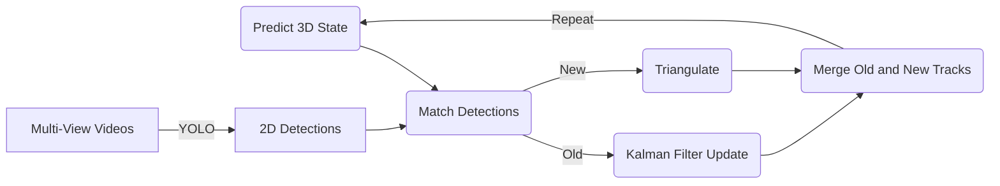
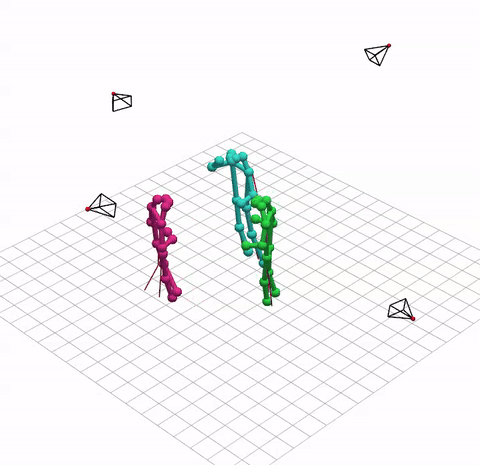

Multi-Person 3D Human Pose Tracking Using Multi-View 2D Detections
==================================================================

## Key Project Deliverables

For evaluation purposes, the most important files are:

* **Source Code:** `code/` - Contains all the source code for the project, including code for environment setup and evaluation.
* **Project Report:** `report/main.pdf` - The comprehensive project report.
* **Final Presentation Slides:** `presentation/main.pdf` - The slides for the final project presentation.

## Project Overview

This project focuses on 3D Human Pose Estimation and Tracking in a Multi-Person and Multi-View setting. The primary goal is to explore the use of an Extended Kalman Filter based implementation that can accurately track 3D poses by fusing the 2D detections generated by a pretrained Human Pose Estimation model. An overview diagram of the system architecture is shown below:



For evaluation of the developed system, this project makes use of the [CMU Panoptic Dataset](http://domedb.perception.cs.cmu.edu/). The dataset consists of multiple sequences recorded from 511 angles together with ground truth human pose and tracking annotations. In this project only a subset of 5 sequences and up to 16 of the available camera views are used per sequence for evaluation, as evaluation would otherwise be too computationally expensive.

> Joo, Hanbyul, et al. "Panoptic studio: A massively multiview system for social motion capture." Proceedings of the IEEE international conference on computer vision. 2015.

Below is an example of the results on one of the CMU Panoptic sequences that was generated using the smallest YOLO26 model (`YOLO26n-pose`) and only 4 camera views.



### Project Structure

The project is organized into the following directories and key files:

```
.
├── code                    # Contains all the source code for the project.
│   ├── 0.setup.ipynb       # Notebook with setup code, installing dependencies and downloading the dataset.
│   ├── 1.evaluation.ipynb  # Notebook for the evaluation of the models using the test set.
│   ├── tracker.py          # This module contains the main entry point for the tracking system.
│   ├── camera.py           # Module including the code for loading camera parameters, projection, and triangulation.
│   ├── dataset.py          # Module with code for downloading and handling the dataset.
│   ├── detect.py           # Module containing code for using the YOLO26-pose type models.
│   ├── kalman.py           # Module with implementation of (extended) Kalman filter functionality.
│   ├── source.py           # A module containing classes for handling video sources in the tracking system.
│   ├── util.py             # Module containing a number of utility classes and functions, for exploration, training, and evaluation.
│   ├── visualize.py        # This module contains code to visualize the results of the tracking system in 3D.
│   ├── data/               # This directory contains the dataset.
│   ├── nets/               # YOLO model weights are stored to this directory.
│   └── stats/              # Evaluation results are stored to this directory.
├── presentation/           # Final project presentation slides (LaTeX).
├── report/                 # Full project report (LaTeX).
├── requirements.txt        # List of required Python dependencies to run the Project.
└── README.md               # This file.
```

## Setup, Installation, Usage

Before starting, you should download the repository locally by running the following commands:

```bash
git clone https://github.com/rolandbernard/cv-project
cd cv-project
```

### Setup

To set up and run this project, follow these steps after downloading the project:

1.  **Create a virtual environment (recommended):**
    ```bash
    python -m venv venv
    source venv/bin/activate  # On Windows, use `venv\Scripts\activate`
    ```
2.  **Install dependencies:**
    The project relies on a set of Python libraries. Install them using `pip`:
    ```bash
    pip install -r requirements.txt
    ```
    *Note: The `requirements.txt` includes specific versions for reproducibility. Ensure your environment is compatible or remove the versions.*

    Alternatively, run the following, which is also the first code cell in `0.setup.ipynb`:
    ```bash
    pip install numpy pandas scipy pillow opencv-python opencv-contrib-python torch torchvision ultralytics matplotlib seaborn pyvista[jupyter] jupyter ipywidgets gdown einops
    ```
3. **Download the Dataset:**
    To download the dataset, and install missing dependencies (if not done in the previous step), simply run all cells in the `0.setup.ipynb` notebook. It will automatically download the dataset and extract it into the `code/data` directory.

### Usage

The project is divided into multiple Python files found in the `code/` directory.
* `tracker.py` contains the main entry point for the implemented tracking system. You may look at `Tracker.evaluate()` for how to use it.
* `visualize.py` contains code to visualize results. In addition to use as a module, this file can also be executed using `python code/visualize.py FILENAME [GT_FILENAME]` where `FILENAME` and `GT_FILENAME` refer to the files generated by the evaluation for the prediction and ground truth respectively.

The `code/` directory also contains the following two Jupyter notebooks:
* For initial setup of dependencies and to download the dataset, take a look at `0.setup.ipynb`.
* `1.evaluation.ipynb` includes the code for running evaluation using the test sequences from the dataset.

In case you want to inspect or modify the tracking algorithm, `tracker.py` contains the main entry point, with the Kalman filter components in `kalman.py` and the detection parts in `detect.py`. Note that the implementation can be configured in different ways, e.g., changing the physics model or the detection network.
